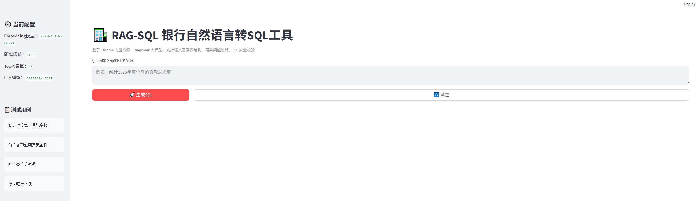

# RAG-SQL 银行信贷自然语言转SQL工具
> 基于RAG实现的业务自然语言转SQL原型，面向银行信贷风控场景。用户使用自然语言提问，系统检索数据库表结构，交由大模型生成可执行SQL，增加多层防御抑制大模型幻觉。

## ✨ 项目亮点
1. **Schema-RAG向量检索**：使用Chroma向量数据库，对数据表元数据做向量化存储；根据用户问题语义召回相关表结构，而非全部表喂给大模型，降低token消耗。
2. **阈值过滤**：向量距离阈值可控，无关问题直接前置拦截，拒绝生成无效SQL。
3. **双层幻觉防御**：向量检索层过滤 + LLM提示词约束，避免大模型脑补不存在字段、表。
4. **SQL安全校验**：简单语法校验，拦截危险DDL语句。
5. **可观测统计**：每次调用输出Token消耗、预估调用成本。
6. **Web界面**：基于Streamlit快速搭建交互网页，支持参数调节、快速测试用例。

## 🛠️ 技术栈
- Python 3.10+
- LLM：DeepSeek API
- 向量库：Chroma
- Embedding：sentence-transformers/all-MiniLM-L6-v2
- Web框架：Streamlit
- 依赖管理：requirements.txt

## 🚀 本地部署运行
### 1. 克隆项目
```bash
git clone <你的github仓库地址>
cd llm_da_project
```

### 2. 创建虚拟环境
```bash
python -m venv venv
# windows激活虚拟环境
venv\Scripts\activate
```

### 3. 安装依赖
```bash
pip install -r requirements.txt
```

### 4. 配置环境变量
复制`.env.example`为`.env`，填入DeepSeek密钥
```env
DEEPSEEK_API_KEY=sk-xxx
DEEPSEEK_BASE_URL=https://api.deepseek.com/v1
EMBEDDING_MODEL=all-MiniLM-L6-v2
DISTANCE_THRESHOLD=0.7
TOP_N=2
```

### 5. 启动网页
```bash
streamlit run app_web.py
```

打开浏览器访问 `http://localhost:8501`

## 🧪 测试用例
|输入问题|预期行为|
|---|---|
|统计放贷每个月总金额|召回信贷表，生成正确业务SQL|
|各个城市逾期贷款金额|召回逾期相关表，输出统计SQL|
|统计客户的数据|表匹配成功，但业务指标模糊，提示补充信息|
|今天吃什么饭|向量检索不命中，直接拦截，拒绝生成SQL|

## ⚠️ 项目局限 & 后续优化方向
> 面试可以直接口述这部分，体现工程思考
1. 当前只是原型，没有接入真实数据库，没有执行SQL获取结果；后续可以接入SQLAlchemy对接真实数据库，拿到查询结果返回前端。
2. Embedding使用开源轻量模型，复杂语义召回效果有限，可替换更好的embedding模型。
3. Rerank重排序模块未接入，可以增加Rerank做二次过滤，提升schema召回准确率。
4. 缺少会话记忆，每次请求独立，后续可以增加多轮对话。
5. 安全校验简单，生产环境需要更完善SQL注入防护。

## 📷 项目截图

> 将网页截图保存，命名`screenshot.png`放在项目根目录。

## 📌 工程踩坑记录
> 曾经尝试部署至Streamlit Cloud，发现Chroma在缺少sentence‑transformers依赖时，会自动降级使用内置ONNX量化Embedding模型。
> 相同文本，完整模型与量化模型向量空间发生偏移，线上distance数值整体变大，检索过滤逻辑失效。
> 本项目显式指定`SentenceTransformerEmbeddingFunction`规避该问题；当前版本优先保证本地环境稳定可复现。
